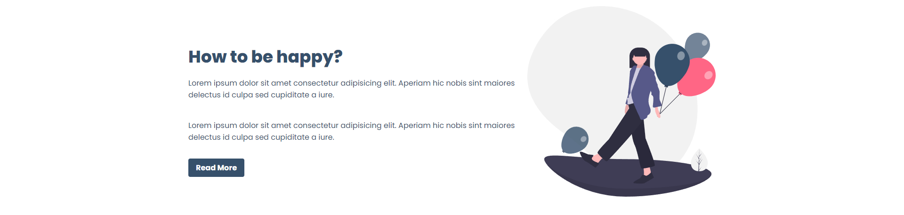
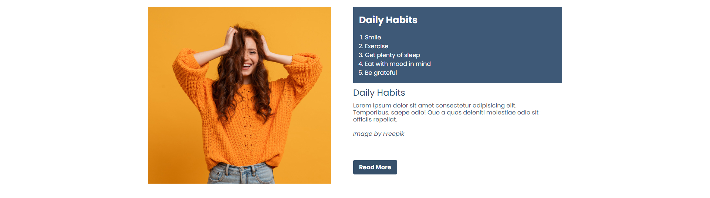

# Web-Project ReactJS Group Workshop Riset Informatika

Repository ini merupakan mini-project dari komunitas Workshop Riset Informatika (WRI) dari grup ReactJS. Website ini berisi mengenai 3 Cara supaya senang dan portofolio beberapa anggota gruop.

# Fitur

- Navbar (Berisi menu navigasi yang berisi link ke home, portofolio, dan about)
  
- Section 1
  
- Section 2
  
- Section 3
  
- Section 4
  
- Section 5
  
- Section 6
  
- Footer
  

# Cara Kontribusi

Untuk berkontribusi silakan Fork repository ini terlebih dahulu.

Untuk commit gunakan kata-kata aksi supaya lebih jelas saat melakukan commit. Misalnya, "Menambahkan Warna Background - Navbar".

Atau bisa jadi contributor secara langsung dari collaborator.

# Contributor

- [Ali Zulfikar](https://www.github.com/alizul01)
- [Ilham Yudantyo](https://www.github.com/ilhamydn17)
- [Mirabell Joice Laura](https://github.com/Mirabelljoicelaura)
- [Ibnu Hajar Askholani](https://https://github.com/askholani)
- [Alfan Olivan](https://github.com/Alivan21)
- [Sukma Gladys Vellanie](https://github.com/sukmagv)
- [Wildan Hafidz Mauludin](https://github.com/nikoshaa)
